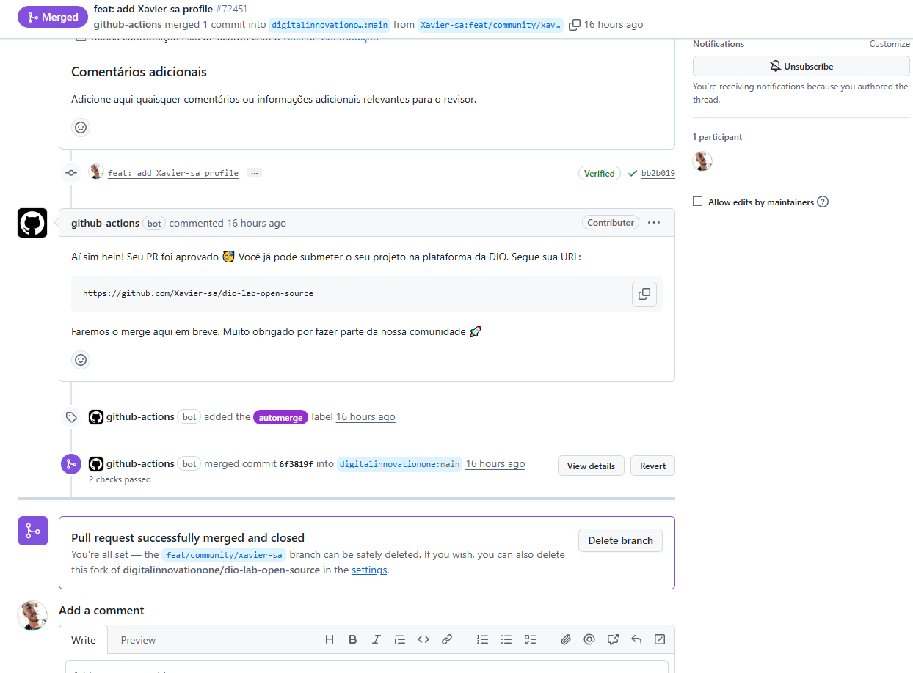

## 🚀 Contribuições Open Source

### DIO Lab Open Source
Participei do desafio de contribuição em projetos reais no GitHub. Criei meu perfil profissional (`Xavier-sa.md`) e submeti via Pull Request para o repositório oficial da Digital Innovation One.

* 📄 **Minha contribuição aceita:** [Ver arquivo no repositório da DIO](https://github.com/digitalinnovationone/dio-lab-open-source/blob/main/community/Xavier-sa.md)
* ✅ **Pull Request Aprovado (#72451):** [Ver histórico da aprovação](https://github.com/digitalinnovationone/dio-lab-open-source/pull/72451)

---
