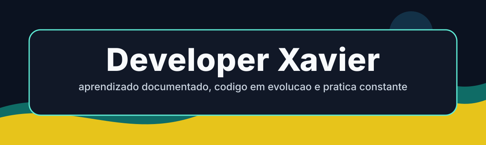

<p align="center">
  
</p>

# Xavier | Biografia de Evolucao em Desenvolvimento

Este repositorio apresenta minha jornada como desenvolvedor em formacao. A proposta nao e esconder os primeiros passos, mas organizar a evolucao para que pessoas tecnicas consigam entender de onde parti, o que pratiquei e como venho amadurecendo minha forma de construir software.

Aqui existem estudos, experimentos, projetos academicos, sistemas pequenos e aplicacoes mais estruturadas. O valor do repositorio esta na leitura da trajetoria: fundamentos, tentativa, erro, melhoria e organizacao progressiva.

## Como Ler Este Repositorio

Para uma avaliacao rapida, comece por estes pontos:

| Area | Caminho | O que observar |
| --- | --- | --- |
| Portfolio biografico | `demonstracoes/portfolio-biografico/` | Pagina visual sobre a jornada, tecnologias e projetos. |
| Projetos aplicados | `projetos/` | Evolucao para aplicacoes com regras, telas, banco e organizacao. |
| Exercicios e desafios | `estudos/codesignal/`, `estudos/linguagens/`, `estudos/w3school/` | Fundamentos, repeticao deliberada e pratica de sintaxe. |
| Estudos academicos | `estudos/estacio/`, `estudos/senac/`, `estudos/modelagem-banco-dados/` | Materiais e exercicios de formacao. |
| Laboratorios | `laboratorios/` | Testes pequenos, automacoes e experimentos preservados. |
| Documentacao de apoio | `documentos/` | Anotacoes e planos de evolucao. |
| Auditoria de branches | `documentos/auditoria-branches.md` | Diagnostico das branches remotas e reaproveitamento seguro de conteudos. |

## Linha de Evolucao

1. Fundamentos: HTML, CSS, JavaScript, Python, PHP e SQL.
2. Pratica guiada: exercicios, pequenos desafios, paginas soltas e scripts de terminal.
3. Projetos com contexto: cadastros, controle financeiro, modelagem de dados e interfaces.
4. Organizacao tecnica: separacao por responsabilidade, padroes de nomes, README por projeto e uso de Git.
5. Proxima fase: melhorar testes, documentar execucao e evoluir arquitetura de projetos com padroes mais consistentes.

## Padrao de Organizacao

Este repositorio passou a usar nomes em portugues do Brasil sempre que o nome nao for uma tecnologia, marca ou convencao tecnica conhecida. As pastas usam letras minusculas, sem acentos e com hifen quando houver mais de uma palavra.

```text
recursos/            imagens e arquivos visuais usados na documentacao
demonstracoes/       paginas e demonstracoes navegaveis
documentos/          notas, planos e material de contexto
projetos/            projetos aplicados ou sistemas em evolucao
laboratorios/        experimentos pequenos e utilitarios
estudos/             cursos, desafios, fundamentos e anotacoes de estudo
```

Branches antigas foram analisadas antes de qualquer merge direto. O conteudo essencial foi reaproveitado dentro dessa estrutura para preservar a historia de evolucao sem quebrar a organizacao atual.

## Acessibilidade

A documentacao foi escrita para leitura direta, com linguagem clara e sem depender apenas de cor para transmitir informacao. O banner usa alto contraste e uma paleta pensada para leitores com diferentes percepcoes de cor.

Diretrizes do repositorio:

- Usar texto alternativo em imagens importantes.
- Evitar instrucoes que dependam apenas de vermelho, verde ou outra cor.
- Preferir contraste forte entre texto e fundo.
- Manter links e caminhos escritos de forma textual.
- Documentar interfaces futuras com foco em teclado, leitores de tela e daltonismo.

Mais detalhes estao em `ACESSIBILIDADE.md`.

## Contribuicao

Este e um repositorio pessoal de evolucao, mas sugestoes tecnicas sao bem-vindas. Antes de propor mudancas, leia `CONTRIBUINDO.md` para manter o historico de aprendizado preservado.

## Licenca

O codigo e os textos deste repositorio estao sob a licenca MIT. Veja `LICENSE`.
