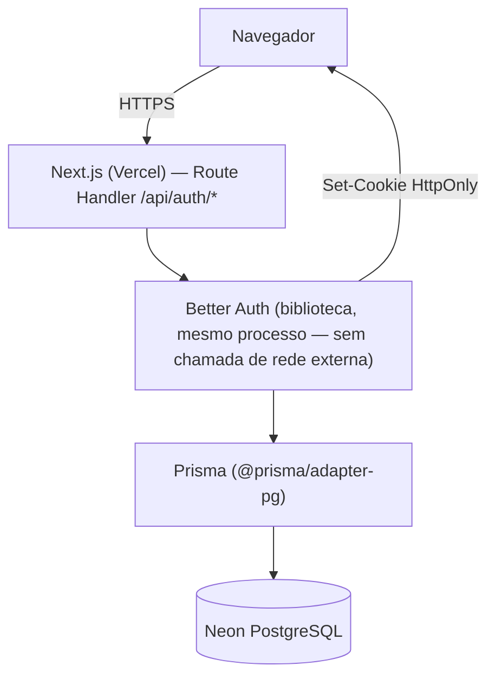
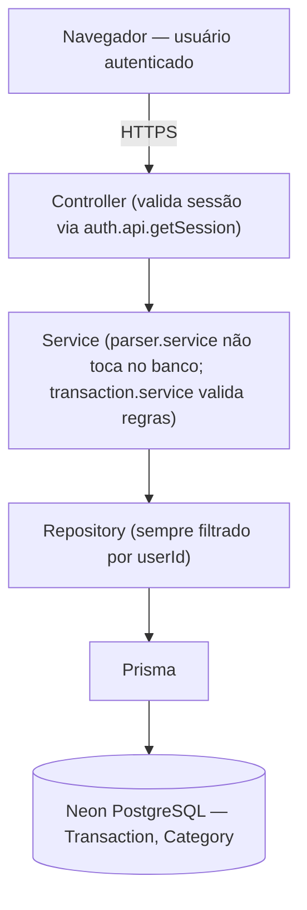
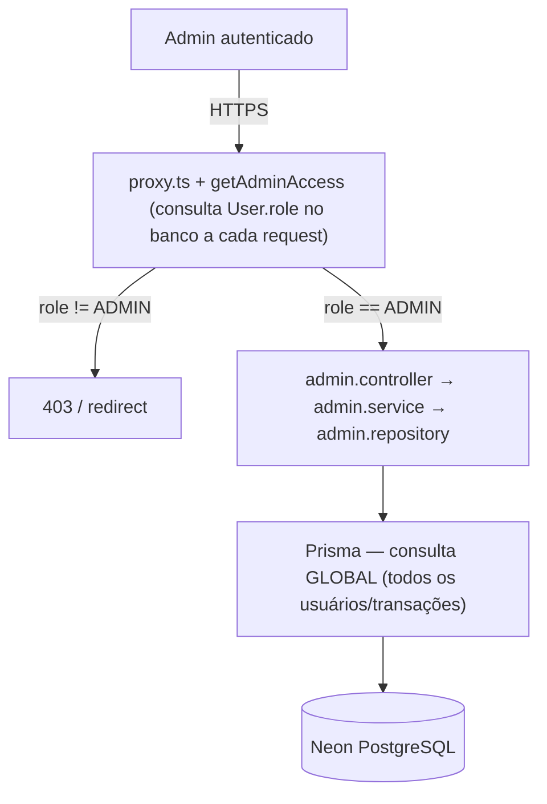
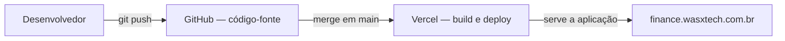

# Mapa de tratamento de dados — FinanceBot

Fase LGPD 2. Documento técnico, **não é a Política de Privacidade nem os
Termos de Uso** (esses virão em fase posterior, após revisão deste mapa).
Organizado por **atividade de tratamento** (é assim que o Art. 37 da LGPD
trata o "registro das operações de tratamento" — por atividade, não por
coluna de banco isolada), para que cada operação tenha origem, finalidade,
base legal e retenção coerentes entre si.

Convenções usadas neste documento:

- **Categoria**: `PESSOAL`, `NÃO PESSOAL` ou `POTENCIALMENTE SENSÍVEL`
  (nos termos do art. 5º, II da LGPD — lista fechada: origem racial/étnica,
  convicção religiosa, opinião política, filiação sindical/religiosa/
  filosófica/política, saúde, vida sexual, dado genético ou biométrico).
  **Dado financeiro não entra automaticamente nessa lista** — só é
  marcado `POTENCIALMENTE SENSÍVEL` quando há risco concreto de conteúdo
  incidental (texto livre), não pelo fato de ser "financeiro".
- **Base legal**: proposta técnico-jurídica, **não é conclusão jurídica
  definitiva** — ver `REVISÃO JURÍDICA` onde marcado.
- **Status da decisão de retenção**: `DECISÃO PENDENTE` onde não há prazo
  definido por lei ou pelo responsável do projeto. Nenhum prazo foi
  inventado.
- **Transferência internacional**: `VERIFICADO`, `NÃO VERIFICADO` ou
  `REVISÃO CONTRATUAL NECESSÁRIA`, conforme evidência real disponível.

---

## 1. Fluxo de dados

### 1.1 Autenticação (Better Auth roda dentro do próprio processo da aplicação)



Better Auth **não é um serviço externo**: é uma biblioteca importada e
executada no mesmo processo da aplicação (`src/lib/auth.ts`). Não há
domínio `better-auth.com` (ou equivalente) chamado em tempo de execução.
A telemetria opcional da biblioteca (`@better-auth/telemetry`) foi
verificada no código-fonte instalado
(`node_modules/@better-auth/telemetry/dist/node.mjs`): só envia qualquer
dado se **duas condições** forem verdadeiras ao mesmo tempo —
`BETTER_AUTH_TELEMETRY_ENDPOINT` definido **e** telemetria habilitada
(`options.telemetry.enabled` ou `BETTER_AUTH_TELEMETRY`). Nenhuma das
duas está presente em `.env.example` nem em `src/lib/auth.ts`. **Conclusão
verificada tecnicamente: telemetria desligada, zero chamada externa.**

### 1.2 Dados financeiros (chat e tela de movimentações)



### 1.3 Acesso administrativo (leitura global, hoje só em ambiente local)



### 1.4 CI/CD (nenhum dado pessoal de usuário final passa por aqui)



**GitHub não recebe dados pessoais de usuários finais** — só código-fonte,
histórico de commits e configuração do CI (variáveis fictícias, sem
segredo real — ver `docs/ci.md`). Não representado como destinatário de
dados pessoais de titulares porque não há evidência de que isso ocorra.

---

## 2. Atividades de tratamento

### 2.1 Cadastro e autenticação

| | |
|---|---|
| **Modelos envolvidos** | `User`, `Account`, `Session`, `Verification` |
| **Origem** | Formulário de cadastro (`/sign-up`) e login (`/sign-in`); `Session`/`Account` são gerados automaticamente pelo Better Auth, não digitados pelo usuário |
| **Finalidade** | Identificar o usuário, autenticar acesso, manter sessão ativa, viabilizar a prestação do serviço |
| **Fluxo** | Ver diagrama 1.1 |
| **Armazenamento** | Neon PostgreSQL (AWS us-east-2, Ohio/EUA — ver seção 4) |
| **Quem acessa** | O próprio usuário (implicitamente, ao usar o app); administrador autorizado consulta `name`/`email`/`role` via `admin.repository.ts` (hoje só em ambiente local, ver seção 2.5); ninguém acessa `Account.password` fora do mecanismo interno do Better Auth |
| **Fornecedor envolvido** | Neon (armazenamento). Vercel (processa em trânsito, hospedagem) |
| **Base legal proposta** | Art. 7º, V — execução de contrato (o cadastro é a adesão ao serviço) |
| **Status jurídico** | `REVISÃO JURÍDICA NECESSÁRIA` — depende dos Termos de Uso ainda não escritos configurarem esse "contrato" validamente |

**Campos:**

| Campo | Categoria | Observação |
|---|---|---|
| `User.id` | PESSOAL (identificador) | cuid interno, identifica o titular dentro do sistema |
| `User.name` | PESSOAL | digitado no cadastro |
| `User.email` | PESSOAL | digitado no cadastro; também é o identificador de login |
| `User.emailVerified` | PESSOAL | hoje **sempre `false`** — não há fluxo de verificação de e-mail implementado |
| `User.image` | PESSOAL (não coletado hoje) | campo existe no schema; **nenhuma tela escreve nele** — confirmado por busca no código |
| `User.createdAt`/`updatedAt` | PESSOAL | metadado da conta |
| `Account.password` (hash) | PESSOAL, confidencialidade máxima | nunca em texto puro; gerenciado só pelo Better Auth; nunca retornado em resposta de API (verificado em `docs/security.md`) |
| `Account.accessToken`/`refreshToken`/`idToken`/`scope` | PESSOAL (não utilizado hoje) | campos existem para suportar login social futuro; **não há provedor social configurado** — colunas vazias na prática |
| `Session.token` | PESSOAL | valor do cookie de sessão, assinado |
| `Session.ipAddress` | PESSOAL | gravado pelo Better Auth por padrão; existe flag oficial `advanced.ipAddress.disableIpTracking` para desligar — **não configurada hoje** (ver seção 3) |
| `Session.userAgent` | PESSOAL | idem, gravado por padrão |
| `Session.expiresAt` | PESSOAL | controla validade de 7 dias |
| `Verification.identifier`/`value` | PESSOAL (pouco usado hoje) | tabela exigida pelo Better Auth; sem serviço de e-mail configurado (`.env.example` não tem SMTP/Resend/SendGrid), então o fluxo que a usaria (verificação de e-mail/redefinição de senha) não está ativo |

**Retenção:**

| Dado | Retenção atual | Retenção proposta | Fundamento | Status |
|---|---|---|---|---|
| `User`/`Account` | Indefinida (sem exclusão de conta implementada) | A definir junto da Fase de exclusão de conta | Direito de eliminação (Art. 18, VI) | `DECISÃO PENDENTE` |
| `Session` | Expira em 7 dias no cookie; **não há rotina confirmada de limpeza da linha no banco após expirar** | Job de limpeza periódica das sessões expiradas | Minimização (Art. 6º, III) | `DECISÃO PENDENTE` |
| `Verification` | Indefinida; pouco usada hoje | Expirar/limpar tokens não usados após curto prazo | Minimização | `DECISÃO PENDENTE` |

---

### 2.2 Registro e consulta de movimentações financeiras

| | |
|---|---|
| **Modelos envolvidos** | `Transaction`, `Category` |
| **Origem** | Chat (linguagem natural) e formulário da tela `/transactions` |
| **Finalidade** | Funcionalidade central do produto: registrar, listar, editar, apagar e resumir (dashboard) as movimentações do próprio usuário |
| **Fluxo** | Ver diagrama 1.2 |
| **Armazenamento** | Neon PostgreSQL |
| **Quem acessa** | Só o próprio usuário (isolamento por `userId` testado — `docs/security.md`); administrador autorizado em consulta global (seção 2.5) |
| **Fornecedor envolvido** | Neon, Vercel |
| **Base legal proposta** | Art. 7º, V — execução de contrato |
| **Status jurídico** | Mesma ressalva da seção 2.1 |

**Campos:**

| Campo | Categoria | Observação |
|---|---|---|
| `Transaction.id`, `userId`, `categoryId` | PESSOAL (identificadores) | ligam o registro ao titular |
| `description` | PESSOAL | texto curto digitado pelo usuário |
| `amount`, `type`, `transactionDate` | PESSOAL | dado financeiro; **não é dado sensível do art. 5º, II** — é dado pessoal comum, mas com natureza financeira que exige proteção robusta (já implementada — ver `docs/security.md`) |
| `paymentMethod` | PESSOAL | campo de **texto livre** (não é um enum/dropdown — confirmado em `TransactionForm.tsx`), opcional; risco menor que `originalMessage` por ser mais contido em prática, mas tecnicamente sem limite do que pode ser digitado |
| `originalMessage` | PESSOAL, **POTENCIALMENTE SENSÍVEL** | ver análise dedicada na seção 3 — decisão já aprovada de parar de gravar em novos registros |
| `Category.name`, `type`, `userId` | PESSOAL quando `userId` preenchido; NÃO PESSOAL quando `userId` nulo (categoria padrão do sistema, ex.: "Mercado") | categoria pessoal criada pelo chat pode conter nome ligeiramente descritivo (ex.: "Presente pro João") — risco baixo, mas existe |

**Retenção:** mesma pendência da seção 2.1 (ligada à futura exclusão de conta, `DECISÃO PENDENTE`). Cascata via `onDelete: Cascade` já existe no schema — tecnicamente, apagar o `User` apagaria `Transaction`/`Category` pessoais junto, mas isso **não deve ser implementado nesta fase** (mudaria comportamento em produção sem aprovação).

---

### 2.3 Preferência de aparência

| | |
|---|---|
| **Modelo** | `UserPreference` |
| **Origem** | Tela `/settings/appearance` |
| **Finalidade** | Lembrar a paleta de tema escolhida pelo usuário |
| **Fluxo** | Navegador → `PATCH /api/settings/appearance` → `preferenceRepository.set(userId, theme)` → Neon. **Sem cookie/localStorage** — confirmei que não existe nenhum uso de `localStorage`/`sessionStorage`/`document.cookie` em todo o código-fonte |
| **Armazenamento** | Neon PostgreSQL |
| **Quem acessa** | Só o próprio usuário |
| **Fornecedor** | Neon, Vercel |
| **Base legal proposta** | Art. 7º, V — execução de contrato (ajuste de UI que o próprio usuário aciona) |
| **Campo** | `theme` (enum fixo: `PAPIRO`/`ESMERALDA`/`OCEANO`/`GRAFITE`/`AMETISTA`) — PESSOAL (ligado ao `userId`), mas risco desprezível: não revela nada sensível sobre o titular |
| **Retenção** | Mesma pendência de conta (2.1) |
| **Status jurídico** | Baixo risco, revisão jurídica não prioritária aqui |

---

### 2.4 Papel administrativo (`role`)

| | |
|---|---|
| **Modelo** | `User.role` (enum `USER`/`ADMIN`) |
| **Situação real** | Existe no `schema.prisma` local. **Migration ainda não aplicada no Neon de produção** — confirmado em `docs/database.md`, `docs/phase-2-authorization.md` e `docs/phase-3-admin.md`, todos consistentes nesse ponto. Preciso de confirmação sua se isso mudou |
| **Origem** | `default("USER")` — atribuído automaticamente; **nenhuma tela permite que o próprio usuário ou a API de cadastro defina o próprio papel** (`src/lib/auth-policy.ts` rejeita explicitamente qualquer body com `role`) |
| **Finalidade** | Controlar quem pode acessar as telas/APIs administrativas |
| **Categoria** | PESSOAL (atributo do titular) |
| **Base legal proposta** | Não é uma finalidade tratada "sobre" o titular para benefício dele — é uma finalidade operacional do controlador. Enquadraria em **Art. 7º, IX — legítimo interesse** (organizar o próprio sistema de permissões) |
| **Status jurídico** | Baixo risco isoladamente; o risco real está no que o papel *permite acessar* (seção 2.5) |

---

### 2.5 Acesso administrativo (consulta global, somente leitura)

| | |
|---|---|
| **Modelos consultados** | `User` (nome, e-mail, papel, contagem de registros), `Transaction` (descrição, valor, tipo, categoria, data, e id/nome/e-mail do dono) — confirmado lendo `admin.repository.ts`: **não** inclui senha, hash, token, sessão, `originalMessage` ou `paymentMethod` |
| **Origem** | Ação de um usuário com `role = ADMIN` nas telas `/admin`, `/admin/users`, `/admin/users/[id]`, `/admin/transactions` |
| **Finalidade proposta** | Operação, suporte, segurança — conforme já anunciado na mini-página `/privacy` atual |
| **Fluxo** | Ver diagrama 1.3 |
| **Quem acessa** | Só contas com `role = ADMIN`, verificado no banco a cada requisição (nunca por papel em cookie/sessão em cache) |
| **Base legal proposta** | Art. 7º, IX — legítimo interesse do controlador, com necessidade e finalidade específica (não uso irrestrito) |
| **Status jurídico** | `REVISÃO JURÍDICA NECESSÁRIA` — legítimo interesse exige o teste de balanceamento do Art. 10, que ainda não foi feito formalmente; ver também seção 5 (proposta de log de auditoria) |
| **Retenção do PRÓPRIO acesso (log)** | Hoje **não existe nenhum registro de quem consultou o quê, quando** — `docs/phase-3-admin.md` confirma isso conscientemente. Ver proposta de `AdminAuditLog` na seção 5 |

---

## 3. `originalMessage` — decisão aprovada e o que muda no mapa

**Decisão aprovada pelo responsável do projeto (ainda não implementada em código nesta fase):**
parar de gravar `originalMessage` em novas `Transaction`, preservando:
- a coluna no banco (sem migration de remoção agora);
- os registros já existentes, sem alteração nem exclusão;
- a possibilidade de o texto continuar existindo **temporariamente em memória** durante o processamento do parser/chat (ele só deixa de ser *persistido*).

**Verificação pedida — APIs continuam devolvendo o campo?** Sim. Confirmei
que `originalMessage` está em `TransactionDTO` (`src/types/index.ts`) e é
devolvido por `GET /api/transactions` e pelas respostas do chat que
incluem a transação criada/atualizada. **Nenhum componente de UI o
exibe** — busquei em todos os componentes de `src/components/transactions/`
e `src/components/chat/` e não há nenhuma renderização desse campo.

**Proposta (não implementada agora):** já que não há necessidade
funcional demonstrada, remover `originalMessage` das respostas públicas
da API (`TransactionDTO`) na mesma fase em que a gravação for
interrompida — não faz sentido parar de gravar em registros novos e
continuar devolvendo o valor histórico de registros antigos por uma API
que nenhuma tela usa. Isso é uma **proposta técnica para a próxima fase de
implementação**, não uma alteração feita agora.

---

## 4. Fornecedores

| Fornecedor | É operador de dados pessoais? | Dados recebidos | Transferência internacional |
|---|---|---|---|
| **Neon** | Sim — armazena fisicamente todos os dados pessoais da aplicação | Todo o conteúdo de `User`, `Session`, `Account`, `Verification`, `Transaction`, `Category`, `UserPreference` | Host observado em sessão técnica anterior: `*.us-east-2.aws.neon.tech` (Ohio, EUA). **VERIFICADO** que o armazenamento primário está nos EUA; **REVISÃO CONTRATUAL NECESSÁRIA** para confirmar as garantias do Art. 33 (cláusulas contratuais padrão, certificação, ou outra hipótese) nos termos comerciais do Neon, que não tenho acesso para ler |
| **Vercel** | Sim, na prática — processa toda requisição HTTP, hospeda a aplicação | Tráfego HTTP; logs de acesso/infraestrutura cujo escopo e retenção **NÃO VERIFICADO** — dependem da configuração da conta/plano Vercel, fora do repositório | Região de execução das funções **não está configurada no repositório** (sem `vercel.json`, sem `regions` declarado) — usa o padrão da conta Vercel. **NÃO VERIFICADO**; precisa checar no painel |
| **Better Auth** | **Não** — é biblioteca executada dentro do próprio processo da aplicação, não um serviço externo que recebe dados. Telemetria opcional confirmada como desligada (seção 1.1) | Nenhum | Não aplicável |

Nenhum outro fornecedor foi encontrado (sem analytics, e-mail transacional, CDN de terceiro ou qualquer outra dependência de rede — `package.json` já auditado na Fase 1).

---

## 5. Proposta de `AdminAuditLog` (conceitual — não implementado)

Conforme aprovado, antes de ampliar o painel `/admin`, propõe-se um
modelo (a ser desenhado formalmente só quando a migration for aprovada):

```
AdminAuditLog
  id
  adminUserId
  action        // ex.: "VIEW_USER", "VIEW_TRANSACTIONS", "VIEW_DASHBOARD"
  targetType    // ex.: "User", "Transaction"
  targetId      // opcional — nulo para consultas de lista/dashboard
  createdAt
```

**Nunca registrar:** senha, hash, token, `DATABASE_URL`, `BETTER_AUTH_SECRET`,
texto financeiro completo, `originalMessage`, ou o resultado completo de
uma consulta (isso duplicaria dados pessoais dentro do próprio log,
criando um segundo lugar para proteger).

**Toda leitura administrativa deve gerar log, ou só eventos sensíveis?**
Avaliando os dois caminhos:

- **Logar toda leitura administrativa** (visão de `/admin` inteira, toda
  listagem, todo detalhe de usuário): dá rastreabilidade completa, mas
  gera volume alto para operações rotineiras de baixo risco (ex.: abrir o
  dashboard agregado, que não identifica ninguém individualmente).
- **Logar só eventos que identificam um titular específico** (abrir o
  detalhe de UM usuário — `/admin/users/[id]`, ou uma listagem de
  transações filtrada por `userId`): menor volume, foca exatamente no que
  a LGPD se importa (acesso a dados de uma pessoa identificável), mas
  deixa sem rastro o uso geral do painel.

**Proposta:** registrar quando o acesso identifica um titular específico
(`targetType`/`targetId` preenchidos — abrir um usuário, filtrar
transações por `userId`) e **não** registrar consultas agregadas/sem
filtro de pessoa (dashboard geral, listagem sem filtro). Isso concentra o
log exatamente nos acessos que a Fase 3 já reconhece como o ponto
sensível do recurso administrativo. `REVISÃO JURÍDICA NECESSÁRIA` para
confirmar se esse recorte é suficiente perto do Art. 37.

Nenhum modelo foi adicionado ao `schema.prisma` nesta fase.

---

## 6. Riscos identificados (resumo)

| Risco | Onde | Gravidade | Situação |
|---|---|---|---|
| Texto livre podendo conter dado incidentalmente sensível | `originalMessage` | Médio | Decisão de parar de gravar já aprovada (seção 3); implementação pendente |
| Texto livre sem limite | `paymentMethod` | Baixo | Não decidido ainda — só documentado |
| Acesso administrativo sem trilha de auditoria | Consulta global (2.5) | Médio | Proposta de `AdminAuditLog` apresentada (seção 5); implementação pendente |
| Dados armazenados fora do Brasil | Neon (EUA) | A avaliar juridicamente | `REVISÃO CONTRATUAL NECESSÁRIA` |
| IP/User-Agent gravados por padrão sem necessidade reavaliada | `Session.ipAddress`/`userAgent` | Baixo | Existe flag oficial do Better Auth para desligar (`disableIpTracking`); decisão de usá-la ainda pendente |
| Ausência de exclusão de conta e exportação de dados | Todo o sistema | Médio | Ambas aprovadas para implementação futura (fases seguintes) |

---

## 7. Pendências jurídicas (resumo para revisão humana)

1. Base legal de execução de contrato depende dos Termos de Uso (ainda não escritos) configurarem validamente esse contrato.
2. Legítimo interesse para acesso administrativo carece do teste de balanceamento do Art. 10.
3. Transferência internacional (Neon nos EUA) carece de verificação contratual (Art. 33).
4. Retenção de `Session`/`Verification`/conta em geral: sem prazo definido — `DECISÃO PENDENTE` do responsável.
5. Suficiência do recorte proposto para `AdminAuditLog` frente ao Art. 37.

Nenhuma dessas pendências foi resolvida por conta própria — todas seguem para revisão jurídica/decisão do responsável antes da Política de Privacidade final.
