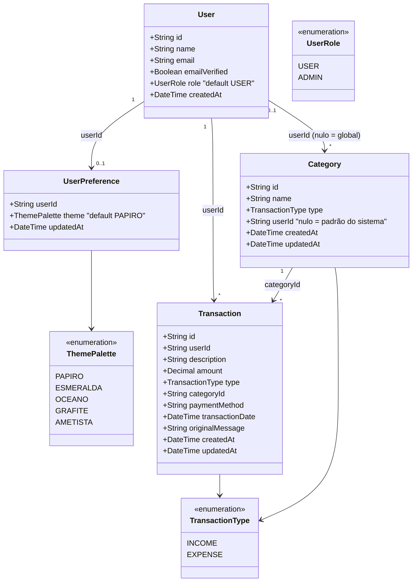
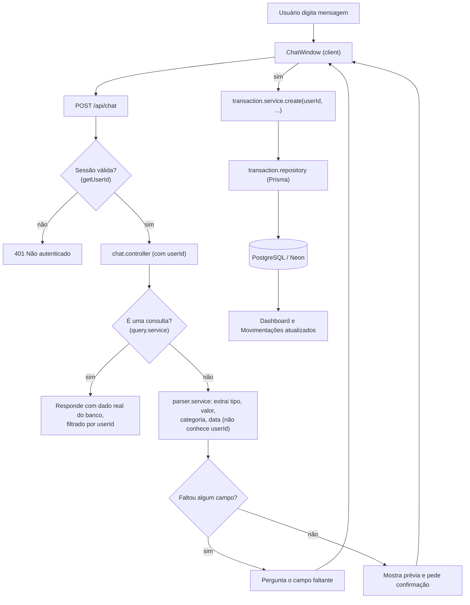
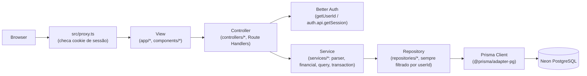

# Diagramas

Diagramas em Mermaid, renderizáveis diretamente pelo GitHub. Refletem o
código como ele existe hoje — nada aqui é aspiracional.

## Diagrama de classes (modelo de dados)

`Session`, `Account` e `Verification` (tabelas do Better Auth,
ver [authentication.md](./authentication.md)) omitidas acima por
brevidade — não fazem parte do domínio financeiro.

## Diagrama de fluxo (registrar uma movimentação pelo chat)

## Diagrama de arquitetura (camadas)

